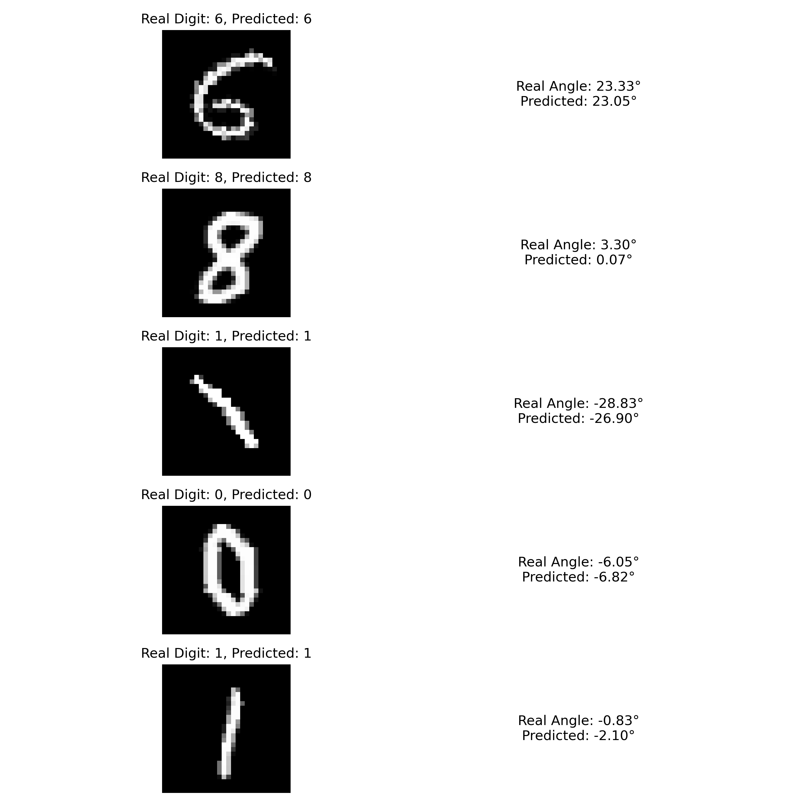

## Colorizing Grayscale Images Using an Autoencoder Model

A project for CPSC 4990: Deep Learning. The core question of this project was "Can a neural network effectively predict the MNIST digit, along with the angle it’s rotated (from -45° to 45°)?"

<p align="center">
    
</p>


## Prerequisites

* [pyenv](https://github.com/pyenv/pyenv) or [Python 3.11.2](https://www.python.org/downloads/)


## Setup

### pyenv

```
pyenv install 3.11.2
```

```
pyenv local 3.11.2
```

### Virtual Environment

```
python -m venv venv
```

#### Windows

```
"venv/Scripts/activate"
```

#### Unix

```
source venv/bin/activate
```

### Packages

```
pip install -U -r requirements.txt
```
